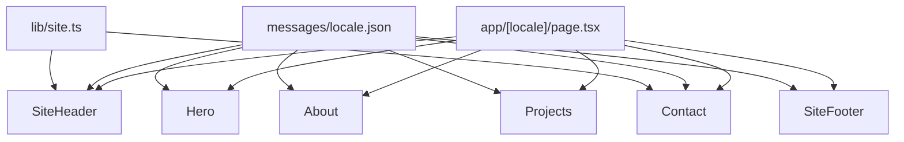

# Estructura base para la landing personal

## Contexto actual

- Stack: [Next.js 16.2](package.json), App Router, React 19, [Tailwind CSS v4](app/globals.css) (`@import "tailwindcss"`), alias `@/*` en [tsconfig.json](tsconfig.json).
- Estado: [app/page.tsx](app/page.tsx) sigue siendo el template de Vercel/Next; [app/layout.tsx](app/layout.tsx) ya define Geist y un `body` en columna.

PostCSS no requiere cambios. `**next.config.ts**` puede necesitar el plugin de **next-intl** según la versión; el resto de la config se mantiene salvo ajustes documentados.

## Arquitectura propuesta

Landing **single-page** con navegación por anclas (`#hero`, `#sobre-mi`, etc.): encaja con “empezar” y evita rutas extra hasta que las necesites. Las URLs incluyen prefijo de idioma: `/es`, `/en`, etc. (configurable).

## Estructura de carpetas a crear

| Ruta                                                   | Rol                                                                                                                                                |
| ------------------------------------------------------ | -------------------------------------------------------------------------------------------------------------------------------------------------- |
| [lib/site.ts](lib/site.ts)                             | Datos **no dependientes del idioma** o compartidos: URLs de redes, `mailto`, slugs de anclas si son estables. El **copy** vive en `messages`.      |
| `messages/es.json`, `messages/en.json`, …              | Cadenas anidadas por sección (`hero.title`, `nav.about`, …). **Aquí editas textos y añades idiomas** duplicando el archivo y el locale en routing. |
| `components/landing/`                                  | Presentación; obtienen strings vía API de **next-intl** en lugar de literales en el código.                                                        |
| `i18n/routing.ts` (o equivalente del doc de next-intl) | Lista de `locales`, `defaultLocale`, `localePrefix` — una fuente de verdad compartida con el middleware.                                           |

**Componentes sugeridos** (nombres en inglés, coherente con el código existente):

- `SiteHeader.tsx` — barra fija o estática con logo/texto y `<nav>` con enlaces internos.
- `Hero.tsx` — título, subtítulo, CTA (p. ej. enlace a `#contacto` o URL externa desde `site`).
- `About.tsx` — párrafo introductorio (placeholder).
- `Projects.tsx` — grid simple de tarjetas placeholder (título + descripción + enlace opcional); datos pueden venir de un array en `site.ts`.
- `Contact.tsx` — bloque con email y enlaces a GitHub/LinkedIn/etc. desde `site.ts`.
- `SiteFooter.tsx` — copyright + nombre.

Opcional y pequeño: `Section.tsx` con `id`, título opcional y `children` para unificar `max-w-`*, padding y espaciado vertical entre secciones.

## Paleta y tokens de color (único lugar para “crear” los colores)

Todo el sistema cromático del proyecto vivirá en **[app/globals.css](app/globals.css)**, aprovechando **Tailwind v4** (`@import "tailwindcss"` + bloque `@theme inline` ya presente). Así defines los colores **una vez** y los usas en componentes como clases utilitarias (`bg-primary`, `text-muted`, etc.) sin repetir hex en cada archivo.

**Enfoque:**

1. **Variables CSS en `:root`** (y, si aplica, en `@media (prefers-color-scheme: dark)` o en un selector equivalente) con los valores base: primario, acento, fondos de sección, texto principal/secundario, bordes, superficies de tarjetas.
2. **Mapeo en `@theme inline`** — extender el bloque existente para exponer esas variables como tokens de Tailwind, por ejemplo `--color-primary`, `--color-accent`, `--color-muted`, `--color-surface`, `--color-border`, además de mantener `background` y `foreground` o alinearlos con los nuevos nombres semánticos.
3. **Nombres semánticos**, no solo “blue-500”: facilita cambiar la marca sin tocar los componentes (solo `globals.css`).
4. Los componentes de `components/landing/` usarán **solo** esos tokens (y escala neutra de zinc/slate si quieres grises de apoyo), no colores arbitrarios sueltos salvo excepciones puntuales.

No hace falta un archivo `colors.ts` separado para la web: en CSS centralizas la paleta; si más adelante necesitas los mismos valores en JS (p. ej. canvas), se puede exportar desde un único sitio, pero la base es **tokens en `globals.css`**.

## Internacionalización (i18n)

**Librería recomendada:** [next-intl](https://next-intl.dev/) — está pensada para el App Router, encaja con Server Components y evita reinventar detección de locale, redirecciones y tipado de claves.

**Flujo:**

1. **Dependencia:** añadir `next-intl` al proyecto (versión compatible con Next 16 según la documentación oficial en el momento de implementar).
2. **Routing por segmento:** mover la aplicación bajo `**app/[locale]/`**: `layout.tsx` (fuentes, `NextIntlClientProvider` si hace falta para partes cliente), `page.tsx` con la landing. El `**lang` del `<html>`** debe salir del segmento dinámico `locale`, no fijo a `es`.
3. `**app/layout.tsx` raíz:** mínimo (a menudo solo `children`) o delegación según el patrón que indique la guía de next-intl para tu versión; el layout con `metadata` traducible puede vivir en `[locale]/layout.tsx` usando `generateMetadata` con el locale.
4. `**middleware.ts` (raíz del repo):** coincide prefijos de URL con los locales soportados, redirige `/` → `/es` (o el `defaultLocale` que elijas), y excluye estáticos/`/_next`/etc.
5. **Configuración central:** archivo tipo `i18n/routing.ts` o `src/i18n/request.ts` (el nombre exacto sigue la doc de next-intl v4) exportando `locales`, `defaultLocale` y la carga de mensajes por locale.
6. **Mensajes:** carpeta `**messages/`** con un JSON por idioma (`es.json`, `en.json`, …). Estructura anidada clara (`nav`, `hero`, `about`, `projects`, `contact`, `footer`, `metadata`). Añadir un idioma = nuevo archivo + añadir el código en `locales`.
7. **Componentes:** en Server Components usar `**getTranslations`** del namespace correspondiente; en Client Components `**useTranslations`**. Los enlaces internos deben preservar el locale: usar el helper `**Link`** de `next-intl` o prefijar con el locale activo según la doc.
8. **Anclas:** las URLs serán del estilo `/es#contacto` — los `href` del nav deben generarse con el path localizado + hash.
9. `**next.config`:** si la versión de next-intl requiere plugin (`createNextIntlPlugin`), añadirlo en [next.config.ts](next.config.ts).

**Alternativa sin dependencia:** segmento `app/[lang]/` + diccionarios importados a mano y middleware casero; es viable para 2 idiomas pero más propenso a errores y sin tipado de claves. Para el plan se asume **next-intl**.

## Cambios en `app/`

1. **Raíz y locale**
  - [app/layout.tsx](app/layout.tsx) — layout raíz mínimo según patrón next-intl + Next 16.
  - [app/[locale]/layout.tsx](app/[locale]/layout.tsx) — `html` con `lang={locale}`, fuentes Geist, `metadata` con `generateMetadata` leyendo mensajes o claves por locale.
2. **[app/[locale]/page.tsx](app/[locale]/page.tsx)** (antes `page.tsx` en la raíz de `app/`)
  - Composición: `<SiteHeader />` + `<main>` + `<SiteFooter />`.
  - Sin assets del template de Vercel en la home.
3. **[app/globals.css](app/globals.css)**
  - Implementar la **paleta** (apartado anterior): variables + `@theme inline` + modo oscuro alineado.
  - Ajustes complementarios: p. ej. `scroll-behavior: smooth` en `html` para anclas; `body` usando `font-family` coherente con `--font-sans` del tema.

## Convenciones

- **Server Components** por defecto (sin `"use client"` salvo que añadas interactividad más adelante: menú móvil, selector de idioma, tema toggle, etc.).
- Estilos con **Tailwind** y **tokens de color semánticos** definidos en `globals.css` (no hardcodear paleta en cada componente).
- **Ningún texto de UI en duro** en JSX salvo pruebas temporales: todo en `messages/*.json` con claves estables.
- Placeholders iniciales al menos en **es** y **en** para validar el flujo i18n; puedes añadir más locales copiando el patrón.
- Selector de idioma (opcional en la primera iteración): enlaces a `/es` y `/en` o componente `LocaleSwitcher` de la doc de next-intl.

## Fuera de alcance de esta base (por si lo quieres después)

- Integración con [al-components](c:\Users\alexe\OneDrive\Documentos\proyectos\al-components): no es necesaria para arrancar; se puede enlazar cuando tengas componentes publicables como paquete.
- Blog, animaciones pesadas o CMS headless: fuera de esta base.

## Verificación

- `npm run build` debe pasar sin errores.
- Probar `**/`, `/es`, `/en`** (o los locales configurados): redirección y que no se rompan rutas estáticas.
- Anclas y scroll entre secciones con prefijo de locale; layout coherente en claro/oscuro.

